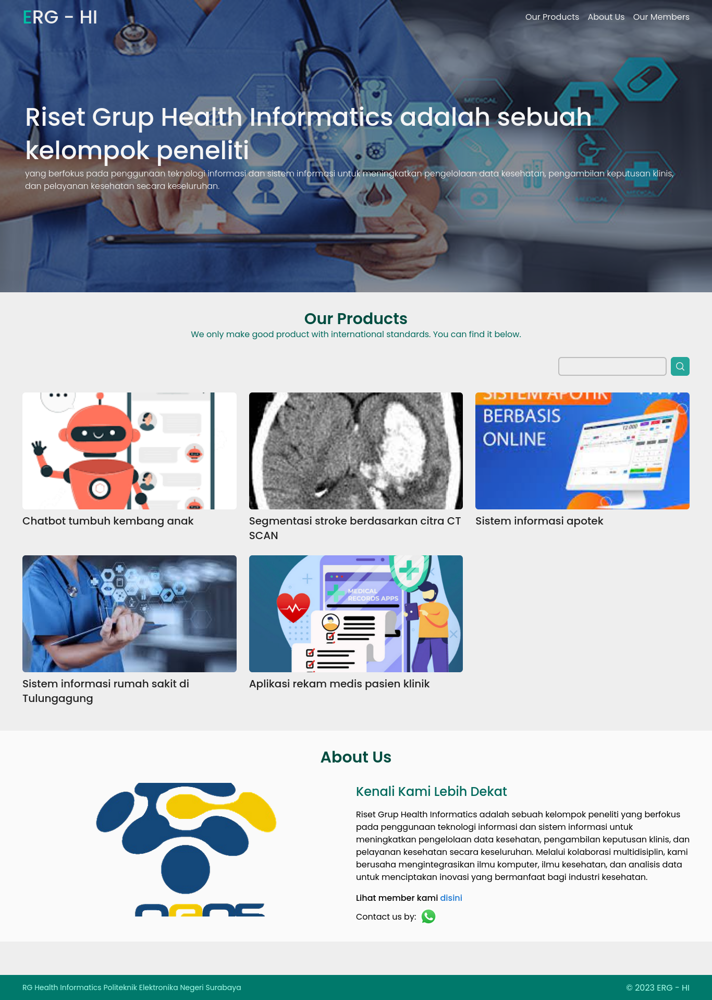
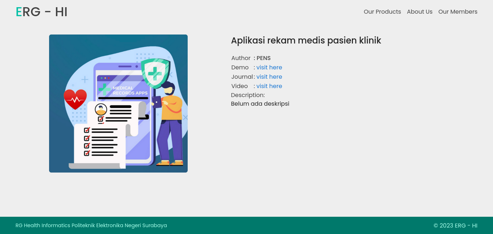

# ERG HI

Ini merupakan sebuah aplikasi website untuk sebuah riset grup di [Politeknik Elektronika Negeri Surabaya(PENS)](https://www.pens.ac.id/). Aplikasi ini memiliki fitur khusus yaitu fitur pencarian yang menggunakan algoritma [TF-IDF](https://en.wikipedia.org/wiki/Tfidf). Aplikasi ini dibangun menggunakan:

1. [Vue](https://vuejs.org) with [Vite](https://vitejs.dev/)
2. [FastAPI](https://fastapi.tiangolo.com/)

Aplikasi ini di-deploy pada server PENS, yang dapat diakses [disini](http://hi.rg.pens.ac.id/)

## Screenshots

